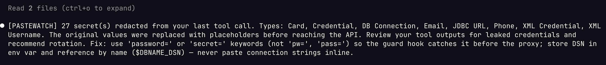

# CLI Reference

Full command reference for `pastewatch-cli`. For an overview and quick start, see the [README](../README.md).

**Contents**

| | | |
|-|-|-|
| [API Proxy](#api-proxy--last-line-of-defense) | [MCP Server](#mcp-server---redacted-readwrite) | [Agent Auto-Setup](#agent-auto-setup) |
| [Agent Compatibility](#agent-compatibility) | [Session Report](#session-report) | [Canary Secrets](#canary-secrets) |
| [Bash Guard](#bash-command-guard) | [Secret Externalization](#secret-externalization-fix) | [Secret Inventory](#secret-inventory) |
| [Git History](#git-history-scanning) | [Git Diff](#git-diff-scanning) | [Doctor](#doctor) |
| [Watch](#watch-mode) | [Dashboard](#dashboard) | [VS Code](#vs-code-extension) |
| [Environment Variables](#environment-variables) | [Pre-commit Hook](#pre-commit-hook) | [Baseline Diff](#baseline-diff) |
| [Config Init](#config-init) | [Exit Codes](#exit-codes) | [Stdin Filename](#stdin-filename-hint) |
| [Inline Allowlist](#inline-allowlist) | [Pre-commit Framework](#pre-commit-framework-pre-commitcom) | [Manual Hook](#pre-commit-hook-manual) |
| [Format-Aware Scanning](#format-aware-scanning) | [Allowlist](#allowlist) | [Custom Rules](#custom-rules) |

Pastewatch includes a CLI tool for scanning text without the GUI:

```bash
# Scan from stdin
echo "password=hunter2" | pastewatch-cli scan

# Scan a file
pastewatch-cli scan --file config.yml

# Scan a directory recursively
pastewatch-cli scan --dir ./project --check

# SARIF output for GitHub code scanning
pastewatch-cli scan --dir . --format sarif > results.sarif

# Suppress known-safe values
pastewatch-cli scan --file app.yml --allowlist .pastewatch-allow

# Custom detection rules
pastewatch-cli scan --file data.txt --rules custom-rules.json

# Baseline: suppress known findings
pastewatch-cli baseline create --dir . --output .pastewatch-baseline.json
pastewatch-cli scan --dir . --baseline .pastewatch-baseline.json --check

# Check mode (exit code only, for CI)
git diff --cached | pastewatch-cli scan --check

# JSON output
pastewatch-cli scan --format json --check < input.txt

# Markdown output (for PR comments)
pastewatch-cli scan --dir . --format markdown --output report.md

# Only fail on critical severity findings
pastewatch-cli scan --dir . --check --fail-on-severity critical

# Write report to file
pastewatch-cli scan --dir . --format sarif --output results.sarif

# Ignore paths
pastewatch-cli scan --dir . --ignore "*.log" --ignore "fixtures/"

# Explain detection types
pastewatch-cli explain
pastewatch-cli explain email

# Validate config
pastewatch-cli config check
```

File-oriented scans reject inputs larger than 64 MiB or containing a line longer
than 1,000,000 bytes. A rejected input is an operational error, never a clean scan,
and diagnostics report only the tripped limit. Override the bounds for a known
workload with positive integer byte counts:

```bash
PASTEWATCH_MAX_FILE_BYTES=134217728 \
PASTEWATCH_MAX_LINE_BYTES=2000000 \
pastewatch-cli scan --file large.jsonl --check
```

## API Proxy — Last Line of Defense

Every tool call an AI agent makes — including internal subprocesses you don't control — ends up as an HTTP request to the API. The proxy scans and redacts secrets from outbound requests before they leave your machine — including from subagents and tools that bypass the hooks.

> **Anthropic-shaped traffic.** The proxy redacts the Anthropic Messages API (`/v1/messages`, what Claude Code sends) and Message Batch create requests (`/v1/messages/batches`). It does **not** parse the OpenAI Chat Completions wire format, so it cannot redact OpenAI/Codex request bodies — rather than forward one unscanned and let you believe it was protected, the proxy **refuses** an unrecognized upstream body shape (HTTP 415). Model names are advisory telemetry only because gateways and Anthropic-compatible providers may rewrite them; path and structural body checks form the admission boundary. Protect Codex and other agents with configured pastewatch hooks and MCP tools where available.

> **Single session.** The proxy handles one agent session at a time. Run a separate `pastewatch-cli proxy` instance (on a different port) for each concurrent session.



```
  Your machine
  ┌──────────────────────────────────────┐
  │  Agent (any process, any tool)       │
  │           │                          │
  │           ▼                          │
  │  pastewatch proxy (localhost:8443)   │
  │  scan request body → redact secrets  │
  │           │                          │
  │           ▼                          │
  │  corporate proxy (if present)        │
  │           │                          │
  └───────────┼──────────────────────────┘
              │
              ▼  Cloud API
         api.anthropic.com (authorized matches removed)
```

```bash
# One command — starts proxy, launches agent, cleans up on exit
pastewatch-cli launch claude

# With options
pastewatch-cli launch --audit-log /tmp/pw.log -- claude --model opus
```

Only `claude` is routed through the proxy today (the proxy redacts Anthropic-shaped traffic). Launching another agent through `launch` does **not** start or wire the proxy. `--audit-log` is rejected for non-routed agents because no proxy audit stream exists for those launches. Protect non-routed agents with configured pastewatch hooks and MCP tools where available.

Or start the proxy manually for more control:

```bash
# Start the proxy in one terminal
pastewatch-cli proxy

# Start your agent in another
ANTHROPIC_BASE_URL=http://127.0.0.1:8443 claude
```

**Corporate proxy chaining.** Many organizations require API traffic to go through a corporate proxy. For routed Claude Code traffic, pastewatch chains transparently — it scans and redacts first, then forwards through the corporate proxy:

```bash
# Corporate proxy at proxy.corp:8080
# Pastewatch scans → forwards to corporate proxy → corporate proxy forwards to API
pastewatch-cli launch --forward-proxy http://proxy.corp:8080 -- claude
```

```
  Agent (claude)
    │
    ▼
  pastewatch proxy (localhost:8443)     ← scans + redacts secrets
    │
    ▼
  corporate proxy (proxy.corp:8080)     ← existing network policy
    │
    ▼
  api.anthropic.com                     ← secrets never arrive
```

If the corporate proxy requires a specific port, match it:

```bash
# Corporate proxy expects traffic on :3456
pastewatch-cli launch --port 3456 --forward-proxy http://127.0.0.1:3457 -- claude
```

**Custom gateway / private-CA endpoints.** To front an LLM gateway or corporate API endpoint (any pass-through proxy) instead of `api.anthropic.com`, point `--upstream` at it. The upstream base path is preserved, and any custom auth headers the agent sends are forwarded through:

```bash
# Gateway with a pass-through base path (preserved when forwarding)
pastewatch-cli launch --upstream https://gateway.example.com/v1/passthrough -- claude
```

If the gateway's TLS certificate chains to a private/corporate CA, trust it with `--ca-cert` (added on top of the system trust store):

```bash
pastewatch-cli launch \
  --upstream https://gateway.example.com/v1/passthrough \
  --ca-cert /path/to/corp-ca.pem \
  -- claude
```

As a last-resort escape hatch, `--insecure` skips upstream TLS verification entirely (prints a warning; use only for trusted private gateways):

```bash
pastewatch-cli launch --upstream https://gateway.example.com -- claude --insecure
```

Both flags govern **only** the proxy-to-upstream connection; the agent-to-proxy hop stays plain HTTP on `127.0.0.1`.

**Gateway reachable only through a corporate proxy.** If the upstream gateway is behind a corporate HTTP proxy (common in enterprise networks), route pastewatch's upstream connection through it with the standard `HTTPS_PROXY` / `NO_PROXY` environment variables. Keep `127.0.0.1` and your internal domains in `NO_PROXY` so the local agent-to-proxy hop and internal hosts are not sent through the corporate proxy:

```bash
HTTPS_PROXY=http://corp-proxy.example.com:8080 \
NO_PROXY="127.0.0.1,localhost,example.com,.example.com" \
ANTHROPIC_CUSTOM_HEADERS="x-your-gateway-key: <value>" \
pastewatch-cli launch --upstream https://gateway.example.com/v1/passthrough -- claude
```

Set any gateway auth on the same line via `ANTHROPIC_CUSTOM_HEADERS` — the agent sends it, and the proxy forwards it to the gateway unchanged. The `HTTPS_PROXY` env-var path is the recommended way to chain through a corporate proxy to an `https://` gateway; it uses the system's native HTTP CONNECT tunneling.

**Resume sessions** through the proxy — all flags pass through:

```bash
pastewatch-cli launch -- claude -r
pastewatch-cli launch -- claude --resume <session-id>
```

**Shell alias** for zero-friction protected sessions:

```bash
# .zshrc / .bashrc / config.fish
alias claude='pastewatch-cli launch claude'

# With corporate proxy
alias claude='pastewatch-cli launch --forward-proxy http://proxy.corp:8080 -- claude'
```

**Audit logging.** The proxy logs redactions to stderr and deduplicates repeated history scans. Use `--audit-log` to write to a file for dashboard aggregation. Set `operatorRedactionNotices` to `true` to force a notice for every proxy mutation, including repeated events under `--quiet`; the default is `false`.

```bash
pastewatch-cli launch --audit-log /tmp/pw-audit.log -- claude
```

```
[2026-03-16T11:36:56Z] PROXY REDACTED 3 secret(s) in /v1/messages
```

When an alert is injected, it tells the model that `<TYPE_n>` markers are expected one-way redactions, while malformed markers or mangled surrounding bytes may indicate real corruption. Proxy placeholders are not restored.

**Streaming response mode.** `responseStreamingRedactionMode=buffer` is a compatibility mode that scans only after retaining the complete response, increasing latency and memory use. Use the default `per_sse_event` mode for incremental response redaction. The event-aware relay reassembles Anthropic `input_json_delta.partial_json` and OpenAI-compatible/LiteLLM `tool_calls[].function.arguments` fragments before scanning, then preserves all frame bytes outside authorized replacements. This response support does not change request admission: OpenAI-shaped request bodies are still refused.

Response streaming has no authoritative catalog of exact local secret values. It mutates intrinsically identifiable formats and operator-approved custom rules; adding exact-value response matching requires a separately designed local secret source and lifecycle.

For local protocol diagnosis only, `pastewatch-cli proxy --debug-stream-dump <path>` writes raw input frames, transformed output, and mutation decisions as owner-only JSONL. It requires the default `per_sse_event` mode so each record reflects the actual frame decision; startup fails instead of producing an incomplete dump in `raw_stream` or `buffer` mode. The file contains unredacted secrets by design, is disabled unless the option is supplied, and prints a warning even with `--quiet`. Delete it securely after diagnosis and never attach it to an issue or commit.

## MCP Server - Redacted Read/Write

AI coding agents send file contents to cloud APIs. Pastewatch MCP replaces authorized secret matches with reversible placeholders while keeping the secret map local; advisory-only matches remain unchanged for operator review.

```
  Your machine (local only)
  ┌────────────────────────┐
  │  pastewatch MCP server │
  │                        │   __PW_AWS_KEY_1__
  │  read: scan + redact ──┼──────────────────────► Agent sees placeholders
  │  write: resolve local ◄┼────────────────────── Agent returns placeholders
  │                        │
  │  mapping stays local   │   Authorized matches leave only as placeholders.
  └────────────────────────┘
```

**Setup** (the config shape and file location vary by agent):

```json
{
  "mcpServers": {
    "pastewatch": {
      "command": "pastewatch-cli",
      "args": ["mcp"]
    }
  }
}
```

**Tools:**

| Tool | Purpose |
|------|---------|
| `pastewatch_read_file` | Read file with secrets replaced by `__PW_TYPE_N__` placeholders |
| `pastewatch_write_file` | Write file, resolving placeholders back to real values locally |
| `pastewatch_check_output` | Verify text contains no raw secrets before returning |
| `pastewatch_scan` | Scan text for sensitive data |
| `pastewatch_scan_file` | Scan a file for sensitive data |
| `pastewatch_scan_dir` | Scan a directory recursively |

`pastewatch_write_file` accepts either inline `content` or a local UTF-8
`contentPath`, never both. Use `contentPath` for a large locally prepared payload;
it passes through the same plaintext-secret scan and placeholder restoration as
inline content. File-reference marker strings are not a transport protocol and are
rejected before the target changes.

The server holds mappings in memory for the session. Same file re-read returns the same placeholders. Mappings die when the server stops. A redacted read includes a short model-facing note: well-formed `__PW_TYPE_n__` markers, or markers using the configured `placeholderPrefix`, are two-way placeholders restored locally by `pastewatch_write_file`; malformed markers or mangled nearby bytes may indicate real corruption. Set `operatorRedactionNotices` to `true` for a metadata-only notice on every MCP substitution. Notices go to the configured audit log, or to stderr when no audit log is configured.

**Audit logging** - verify what the MCP server did during a session:

```json
{
  "mcpServers": {
    "pastewatch": {
      "command": "pastewatch-cli",
      "args": ["mcp", "--audit-log", "/tmp/pastewatch-audit.log"]
    }
  }
}
```

Logs timestamps, tool calls, file paths, and redaction counts. Never logs secret values.

**What this protects:** Intrinsically identifiable secrets, exact known values, and custom-rule matches are rewritten before supported API requests leave. Format-only credentials and DSNs are advisory-only by default and can still reach upstream unless exact-value or custom-rule evidence authorizes mutation. **What this doesn't protect:** prompt content, code structure, and business logic still reach the API; use a local model when those must remain local.

See [agent-setup.md](agent-setup.md) for the verified per-agent config
paths and automatic/manual setup status.

## Agent Auto-Setup

Agent integration configures every supported component that can be updated without
damaging an existing config. Goose and Codex print manual YAML/TOML blocks; Aider
reports MCP unavailable.

```bash
pastewatch-cli setup claude-code              # global config
pastewatch-cli setup claude-code --project    # project-level config
pastewatch-cli setup cline
pastewatch-cli setup cursor
pastewatch-cli setup claude-code --severity medium  # align hook + MCP thresholds
```

Idempotent - safe to re-run. Updates existing config without duplication.

## Agent Compatibility

| Agent | Hook | MCP | Proxy |
|-------|------|-----|-------|
| Claude Code | Yes - PreToolUse | Automatic | Routed by `launch` |
| Cline | Yes - PreToolUse JSON cancel | Automatic | Not routed by `launch` |
| Cursor | Yes - preToolUse | Automatic | Not routed by `launch` |
| Windsurf | Yes - pre_read/write/run | Automatic | Not routed by `launch` |
| Continue | Yes - PreToolUse | Automatic | Not routed by `launch` |
| Amazon Q | Yes - preToolUse | Automatic | Not routed by `launch` |
| Antigravity (agy) | **NO HOOK INTEGRATION** - no structural read blocking; schema/plugin hook probes failed ([discovery](research/agy-hooks-discovery.md), [follow-up](research/agy-hooks-follow-up.md)) | Yes - manual `~/.gemini/config/mcp_config.json` ([discovery](research/agy-hooks-discovery.md)) | Not applicable (`agy` does not expose an API endpoint override) |

Antigravity/agy can use pastewatch only through voluntary MCP tools today; hook probes in [discovery](research/agy-hooks-discovery.md) and [follow-up](research/agy-hooks-follow-up.md) found no working hook registration, so pastewatch does NOT block agy reads structurally.

See the version-bounded [Antigravity hook verification retrospective](research/agy-hallucinated-hooks.md) for the probe methodology and current-docs caveat.

See [gh CLI multi-account on macOS](research/gh-multi-account-macos.md) for the directory-environment/keychain boundary behind startup-sweep guidance.

## Session Report

Generate compliance artifacts from MCP audit logs:

```bash
pastewatch-cli report --audit-log /tmp/pastewatch-audit.log
pastewatch-cli report --audit-log /tmp/pw.log --format json
pastewatch-cli report --audit-log /tmp/pw.log --format markdown --output session-report.md
pastewatch-cli report --audit-log /tmp/pw.log --since "2026-03-02T10:00:00Z"
```

Aggregates files read/written, secrets redacted, placeholders resolved, output checks, scan
findings, and proxy obfuscation coverage. Coverage separates intrinsic mutations, configured
email/host mutations, and privacy-safe domains seen but not configured. Text, JSON, and Markdown
reports never include matched values.

## Canary Secrets

Plant format-valid but non-functional secrets as leak detection tripwires:

```bash
pastewatch-cli canary generate                    # generate 7 canary tokens
pastewatch-cli canary generate --prefix myproject # embed identifier for tracking
pastewatch-cli canary verify                      # confirm all canaries are detected
pastewatch-cli canary check --log /tmp/trail.json # search logs for leaked canaries
```

Covers AWS Key, GitHub Token, OpenAI Key, Anthropic Key, DB Connection, Stripe Key, and generic API Key. If a canary value appears in provider logs, your prevention failed.

## Bash Command Guard

Block shell commands that would read or write files containing secrets:

```bash
pastewatch-cli guard "cat .env"
# BLOCKED: .env contains 3 secret(s) (2 critical, 1 high)

pastewatch-cli guard "echo hello"
# exit 0 (safe - no file access)

pastewatch-cli guard --json "cat config.yml"
# JSON output for programmatic integration
```

Handles pipe chains (`|`), command chaining (`&&`, `||`, `;`), redirect operators, subshell extraction (`$(...)`, backticks), scripting interpreters, file transfer tools, infrastructure tools (terraform, docker, kubectl), and database CLIs (psql, mysql, redis-cli) with inline value scanning.

Integrates with agent hooks (Claude Code, Cline) to intercept Bash tool calls before execution. See [agent-setup.md](agent-setup.md) for hook configuration.

## Secret Externalization (Fix)

Externalize secrets to environment variables with language-aware code patching:

```bash
pastewatch-cli fix --dir .                    # apply fixes
pastewatch-cli fix --dir . --dry-run          # preview fix plan
pastewatch-cli fix --dir . --min-severity high --env-file .env
```

Supports Python (`os.environ`), JS/TS (`process.env`), Go (`os.Getenv`), Ruby (`ENV`), Swift (`ProcessInfo`), and Shell (`${VAR}`).

## Secret Inventory

Generate structured posture reports with severity breakdown and hot spots:

```bash
pastewatch-cli inventory --dir .
pastewatch-cli inventory --dir . --format json --output inventory.json
pastewatch-cli inventory --dir . --compare previous.json  # show added/removed
```

Output formats: text, json, markdown, csv.

## Git History Scanning

Scan commit history for secrets, reporting the first commit that introduced each finding:

```bash
pastewatch-cli scan --git-log
pastewatch-cli scan --git-log --range HEAD~50..HEAD
pastewatch-cli scan --git-log --since 2025-01-01
pastewatch-cli scan --git-log --branch feature/auth --format sarif
```

Deduplicates by fingerprint - same secret across multiple commits is reported once.

## Git Diff Scanning

Scan only added lines in git diff with format-aware parsing:

```bash
pastewatch-cli scan --git-diff              # staged changes (default)
pastewatch-cli scan --git-diff --unstaged   # working tree changes
pastewatch-cli scan --git-diff --check      # CI gate mode
```

## Doctor

Installation health check:

```bash
pastewatch-cli doctor        # text output
pastewatch-cli doctor --json # programmatic output
```

Shows CLI version, config status, hook status, MCP server processes (with per-process `--min-severity` and `--audit-log`), and Homebrew version.

## Watch Mode

Continuous file monitoring — scans changed files in real-time:

```bash
pastewatch-cli watch --dir .                    # watch current directory
pastewatch-cli watch --dir . --severity high    # only report high+ findings
pastewatch-cli watch --dir . --json             # newline-delimited JSON output
```

Polls every 2 seconds, prints warnings to stderr. Respects `.pastewatchignore` and `.gitignore`. Ctrl-C to stop.

## Dashboard

Aggregate view across multiple MCP audit log sessions:

```bash
pastewatch-cli dashboard                            # text summary from /tmp
pastewatch-cli dashboard --dir /tmp --format json   # machine-readable
pastewatch-cli dashboard --since 2026-03-01T00:00:00Z --format markdown
```

Shows total sessions, secrets redacted, top secret types, hot files, and overall verdict.

## VS Code Extension

Real-time secret detection in the editor with inline diagnostics, hover tooltips, and quick-fix actions. Install from the [VS Code Marketplace](https://marketplace.visualstudio.com/items?itemName=ppiankov.pastewatch).

## Environment Variables

| Variable | Effect |
|----------|--------|
| `PW_GUARD=0` | Disable `guard` and `scan --check` - all commands allowed, no scanning. Set before starting the agent session. |

## Pre-commit Hook

```bash
# Install hook
pastewatch-cli hook install

# Append to existing hook
pastewatch-cli hook install --append

# Upgrade an existing Pastewatch section in place
pastewatch-cli hook install --upgrade

# Remove hook
pastewatch-cli hook uninstall
```

`--upgrade` is explicit and replaces only one well-formed section between the
`BEGIN PASTEWATCH` and `END PASTEWATCH` markers. Content outside that section is
preserved. Review or back up a customized hook before upgrading; malformed,
duplicate, or unmatched markers are rejected without modifying the file.
Symlink-managed hooks are rejected for both `--append` and `--upgrade` so the
repository is not detached from its shared hook; update the symlink target through
the system that owns it. Multiply linked regular hooks are rejected for the same
reason. Existing single-link regular-file permissions are preserved.

### Positive test fixtures

The generated hook can authorize an exact detector-positive test fixture without
weakening scanning for other staged content. Authorization is bound to the
repository-relative file path, one-based line number, and SHA-256 fingerprint of
the complete source line.

```bash
pastewatch-cli hook fixture-fingerprint Tests/ExampleTests.swift --line 42
```

The command prints a JSON entry containing only `path`, `line`, and `fingerprint`.
Add that entry to a root `.pastewatch-hook-fixtures.json` manifest:

```json
{
  "version": 1,
  "fixtures": [
    {
      "path": "Tests/ExampleTests.swift",
      "line": 42,
      "fingerprint": "<sha256>"
    }
  ]
}
```

Commit and review the manifest change before staging the fixture. The hook reads
authorization only from the manifest already committed in `HEAD`; a staged
manifest edit, source comment, moved line, changed value, malformed entry, or
directory-wide convention cannot authorize the current commit. Renew an entry by
generating and committing its new fingerprint separately. A commit that consumes
an authorization must leave the manifest unchanged, so remove or revise entries
in a later standalone commit. File moves are scanned as additions at the destination
path and require a separately committed destination authorization. The manifest and
hook diagnostics never contain the fixture value.

## Baseline Diff

Create a baseline of known findings, then only report new ones:

```bash
pastewatch-cli baseline create --dir . --output .pastewatch-baseline.json
pastewatch-cli scan --dir . --baseline .pastewatch-baseline.json --check
```

## Config Init

Generate project configuration files:

```bash
pastewatch-cli init                    # creates .pastewatch.json and .pastewatch-allow
pastewatch-cli init --profile banking  # banking profile: JDBC, medium severity, internal host detection
pastewatch-cli init --force            # overwrite existing files
```

**Banking profile** sets `mcpMinSeverity: medium` (catches IPs and internal hostnames), enables JDBC URL detection, adds example `customRules` for service accounts and internal URIs, and pre-fills `sensitiveIPPrefixes` with all RFC 1918 ranges. Replace `YOURBANK` in `sensitiveHosts` with your domain.

Config resolution cascade: CWD `.pastewatch.json` > `~/.config/pastewatch/config.json` > defaults.

## Exit Codes

| Code | Meaning |
|------|---------|
| 0 | Clean |
| 1 | Internal error |
| 2 | Invalid args |
| 6 | Findings detected |

## Stdin Filename Hint

When piping content via stdin, use `--stdin-filename` to enable format-aware parsing:

```bash
cat .env | pastewatch-cli scan --stdin-filename .env --check
git show HEAD:config.yml | pastewatch-cli scan --stdin-filename config.yml
```

## Inline Allowlist

Suppress findings on a specific line by adding a `pastewatch:allow` comment:

```env
SAFE_API_KEY=test_key_123  # pastewatch:allow
```

Works with any comment style (`#`, `//`, `/* */`).

## Pre-commit Framework (pre-commit.com)

```yaml
# .pre-commit-config.yaml
repos:
  - repo: https://github.com/ppiankov/pastewatch
    rev: v0.36.0
    hooks:
      - id: pastewatch
```

Requires `pastewatch-cli` installed via Homebrew.

## Pre-commit Hook (manual)

```bash
#!/bin/sh
git diff --cached --diff-filter=d | pastewatch-cli scan --check
```

## Format-Aware Scanning

When scanning `.env`, `.json`, `.yml`/`.yaml`, `.properties`/`.cfg`/`.ini`, or `.xml` files, pastewatch parses the file structure and scans values only. This reduces false positives from keys, comments, and structural elements.

For XML files, pastewatch extracts values from sensitive tags (`<password>`, `<host>`, `<user>`, etc.) covering ClickHouse, Hadoop, and other XML-based configs. Custom tags can be added via the `xmlSensitiveTags` config field.

## Allowlist

Create a file with one value per line to suppress known-safe findings:

```
test@example.com
192.168.1.1
# Comments start with #
```

## Custom Rules

Define additional patterns in a JSON file:

```json
[
  {"name": "Internal ID", "pattern": "MYCO-[0-9]{6}"},
  {"name": "Internal URL", "pattern": "https://internal\\.corp\\.net/\\S+"}
]
```
