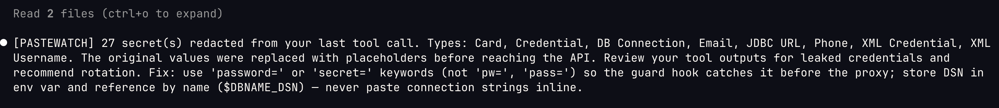

# CLI Reference

Full command reference for `pastewatch-cli`. For an overview and quick start, see the [README](../README.md).

<!-- WO-640: Make diagnostic and policy documentation discoverable. -->
**Contents**

| | | |
|-|-|-|
| [API Proxy](#api-proxy--last-line-of-defense) | [MCP Server](#mcp-server---redacted-readwrite) | [Agent Auto-Setup](#agent-auto-setup) |
| [Agent Compatibility](#agent-compatibility) | [Session Report](#session-report) | [Canary Secrets](#canary-secrets) |
| [Bash Guard](#bash-command-guard) | [Secret Externalization](#secret-externalization-fix) | [Secret Inventory](#secret-inventory) |
| [Git History](#git-history-scanning) | [Git Diff](#git-diff-scanning) | [Doctor](#doctor) |
| [Watch](#watch-mode) | [Dashboard](#dashboard) | [VS Code](#vs-code-extension) |
| [Environment Variables](#environment-variables) | [Pre-commit Hook](#pre-commit-hook) | [Baseline Diff](#baseline-diff) |
| [Config Init](#config-init) | [Exit Codes](#exit-codes) | [Stdin Filename](#stdin-filename-hint) |
| [Inline Allowlist](#inline-allowlist) | [Pre-commit Framework](#pre-commit-framework-pre-commitcom) | [Manual Hook](#pre-commit-hook-manual) |
| [Format-Aware Scanning](#format-aware-scanning) | [Allowlist](#allowlist) | [Custom Rules](#custom-rules) |
| [Check](#check) | [Doctor --explain](#doctor---explain) | [Documentation Policy](#documentation-policy) |

For inactive rules or unexpected guard decisions, start with [Troubleshooting](troubleshooting.md).

Pastewatch includes a CLI tool for scanning text without the GUI:

```bash
# Scan from stdin
echo "password=hunter2" | pastewatch-cli scan

# Scan a file
pastewatch-cli scan --file config.yml

# Scan a directory recursively
pastewatch-cli scan --dir ./project --check

# SARIF output for GitHub code scanning
pastewatch-cli scan --dir . --format sarif > results.sarif

# Suppress known-safe values
pastewatch-cli scan --file app.yml --allowlist .pastewatch-allow

# Custom detection rules
pastewatch-cli scan --file data.txt --rules custom-rules.json

# Baseline: suppress known findings
pastewatch-cli baseline create --dir . --output .pastewatch-baseline.json
pastewatch-cli scan --dir . --baseline .pastewatch-baseline.json --check

# Check mode (exit code only, for CI)
git diff --cached | pastewatch-cli scan --check

# JSON output
pastewatch-cli scan --format json --check < input.txt

# Markdown output (for PR comments)
pastewatch-cli scan --dir . --format markdown --output report.md

# Only fail on critical severity findings
pastewatch-cli scan --dir . --check --fail-on-severity critical

# Write report to file
pastewatch-cli scan --dir . --format sarif --output results.sarif

# Ignore paths
pastewatch-cli scan --dir . --ignore "*.log" --ignore "fixtures/"

# Explain detection types
pastewatch-cli explain
pastewatch-cli explain email

# Validate config
pastewatch-cli config check
```

File-oriented scans reject inputs larger than 64 MiB. Single-file scans also reject
lines longer than 1,000,000 bytes. Directory, Git diff/history and watch scans skip
overlong files, name their paths on stderr and count them as `skippedOverLimit`;
they do not abort inspection of the remaining files. Whole-file limit errors still
abort. Newly supported source extensions accept ISO-8859-1 for detection only if
UTF-8 decoding fails; no file is rewritten. Override the bounds for a known
workload with positive integer byte counts:

```bash
PASTEWATCH_MAX_FILE_BYTES=134217728 \
PASTEWATCH_MAX_LINE_BYTES=2000000 \
pastewatch-cli scan --file large.jsonl --check
```

## API Proxy — Last Line of Defense

Every tool call an AI agent makes — including internal subprocesses you don't control — ends up as an HTTP request to the API. The proxy scans and redacts secrets from outbound requests before they leave your machine — including from subagents and tools that bypass the hooks.

> **Anthropic-shaped traffic.** The proxy redacts the Anthropic Messages API (`/v1/messages`, what Claude Code sends) and Message Batch create requests (`/v1/messages/batches`). It does **not** parse the OpenAI Chat Completions wire format, so it cannot redact OpenAI/Codex request bodies — rather than forward one unscanned and let you believe it was protected, the proxy **refuses** an unrecognized upstream body shape (HTTP 415). Model names are advisory telemetry only because gateways and Anthropic-compatible providers may rewrite them; path and structural body checks form the admission boundary. Protect Codex and other agents with configured pastewatch hooks and MCP tools where available.

> **Single session.** The proxy handles one agent session at a time. Run a separate `pastewatch-cli proxy` instance (on a different port) for each concurrent session.

<!-- WO-649@v1: Linux forwarding requires an executable curl before the proxy can listen. -->
**Linux requirements.** Install `curl` (Debian/Ubuntu: `sudo apt-get install curl`). The proxy checks `/usr/bin/curl` first, then executable `curl` files on `PATH`, and logs the selected path. If none is available, startup exits 2 before listening. `pastewatch-cli doctor` reports the resolved path or the missing dependency and installation remedy. macOS uses its existing native HTTP transport and does not require curl.



```
  Your machine
  ┌──────────────────────────────────────┐
  │  Agent (any process, any tool)       │
  │           │                          │
  │           ▼                          │
  │  pastewatch proxy (localhost:8443)   │
  │  scan request body → redact secrets  │
  │           │                          │
  │           ▼                          │
  │  corporate proxy (if present)        │
  │           │                          │
  └───────────┼──────────────────────────┘
              │
              ▼  Cloud API
         api.anthropic.com (authorized matches removed)
```

```bash
# One command — starts proxy, launches agent, cleans up on exit
pastewatch-cli launch claude

# With options
pastewatch-cli launch --audit-log /tmp/pw.log -- claude --model opus
```

Only `claude` is routed through the proxy today (the proxy redacts Anthropic-shaped traffic). Launching another agent through `launch` does **not** start or wire the proxy. `--audit-log` is rejected for non-routed agents because no proxy audit stream exists for those launches. Protect non-routed agents with configured pastewatch hooks and MCP tools where available.

Or start the proxy manually for more control:

```bash
# Start the proxy in one terminal
pastewatch-cli proxy

# Start your agent in another
ANTHROPIC_BASE_URL=http://127.0.0.1:8443 claude
```

**Corporate proxy chaining.** Many organizations require API traffic to go through a corporate proxy. For routed Claude Code traffic, pastewatch chains transparently — it scans and redacts first, then forwards through the corporate proxy:

```bash
# Corporate proxy at proxy.corp:8080
# Pastewatch scans → forwards to corporate proxy → corporate proxy forwards to API
pastewatch-cli launch --forward-proxy http://proxy.corp:8080 -- claude
```

```
  Agent (claude)
    │
    ▼
  pastewatch proxy (localhost:8443)     ← scans + redacts secrets
    │
    ▼
  corporate proxy (proxy.corp:8080)     ← existing network policy
    │
    ▼
  api.anthropic.com                     ← secrets never arrive
```

If the corporate proxy requires a specific port, match it:

```bash
# Corporate proxy expects traffic on :3456
pastewatch-cli launch --port 3456 --forward-proxy http://127.0.0.1:3457 -- claude
```

**Custom gateway / private-CA endpoints.** To front an LLM gateway or corporate API endpoint (any pass-through proxy) instead of `api.anthropic.com`, point `--upstream` at it. The upstream base path is preserved, and any custom auth headers the agent sends are forwarded through:

```bash
# Gateway with a pass-through base path (preserved when forwarding)
pastewatch-cli launch --upstream https://gateway.example.com/v1/passthrough -- claude
```

If the gateway's TLS certificate chains to a private/corporate CA, trust it with `--ca-cert` (added on top of the system trust store):

```bash
pastewatch-cli launch \
  --upstream https://gateway.example.com/v1/passthrough \
  --ca-cert /path/to/corp-ca.pem \
  -- claude
```

As a last-resort escape hatch, `--insecure` skips upstream TLS verification entirely (prints a warning; use only for trusted private gateways):

```bash
pastewatch-cli launch --upstream https://gateway.example.com -- claude --insecure
```

Both flags govern **only** the proxy-to-upstream connection; the agent-to-proxy hop stays plain HTTP on `127.0.0.1`.

**Gateway reachable only through a corporate proxy.** If the upstream gateway is behind a corporate HTTP proxy (common in enterprise networks), route pastewatch's upstream connection through it with the standard `HTTPS_PROXY` / `NO_PROXY` environment variables. Keep `127.0.0.1` and your internal domains in `NO_PROXY` so the local agent-to-proxy hop and internal hosts are not sent through the corporate proxy:

```bash
HTTPS_PROXY=http://corp-proxy.example.com:8080 \
NO_PROXY="127.0.0.1,localhost,example.com,.example.com" \
ANTHROPIC_CUSTOM_HEADERS="x-your-gateway-key: <value>" \
pastewatch-cli launch --upstream https://gateway.example.com/v1/passthrough -- claude
```

Set any gateway auth on the same line via `ANTHROPIC_CUSTOM_HEADERS` — the agent sends it, and the proxy forwards it to the gateway unchanged. The `HTTPS_PROXY` env-var path is the recommended way to chain through a corporate proxy to an `https://` gateway; it uses the system's native HTTP CONNECT tunneling.

**Resume sessions** through the proxy — all flags pass through:

```bash
pastewatch-cli launch -- claude -r
pastewatch-cli launch -- claude --resume <session-id>
```

**Shell alias** for zero-friction protected sessions:

```bash
# .zshrc / .bashrc / config.fish
alias claude='pastewatch-cli launch claude'

# With corporate proxy
alias claude='pastewatch-cli launch --forward-proxy http://proxy.corp:8080 -- claude'
```

**Audit logging.** The proxy logs redactions to stderr and deduplicates repeated history scans. Use `--audit-log` to write to a file for dashboard aggregation. Set `operatorRedactionNotices` to `true` to force a notice for every proxy mutation, including repeated events under `--quiet`; the default is `false`.

```bash
pastewatch-cli launch --audit-log /tmp/pw-audit.log -- claude
```

```
[2026-03-16T11:36:56Z] PROXY REDACTED 3 secret(s) in /v1/messages
```

When an alert is injected, it tells the model that `<TYPE_n>` markers are expected one-way redactions, while malformed markers or mangled surrounding bytes may indicate real corruption. Proxy placeholders are not restored.

**Streaming response mode.** `responseStreamingRedactionMode=buffer` is a compatibility mode that scans only after retaining the complete response, increasing latency and memory use. Use the default `per_sse_event` mode for incremental response redaction. The event-aware relay reassembles Anthropic `input_json_delta.partial_json` and OpenAI-compatible/LiteLLM `tool_calls[].function.arguments` fragments before scanning, then preserves all frame bytes outside authorized replacements. This response support does not change request admission: OpenAI-shaped request bodies are still refused.

Response streaming has no authoritative catalog of exact local secret values. It mutates intrinsically identifiable formats and operator-approved custom rules; adding exact-value response matching requires a separately designed local secret source and lifecycle.

For local protocol diagnosis only, `pastewatch-cli proxy --debug-stream-dump <path>` writes raw input frames, transformed output, and mutation decisions as owner-only JSONL. It requires the default `per_sse_event` mode so each record reflects the actual frame decision; startup fails instead of producing an incomplete dump in `raw_stream` or `buffer` mode. The file contains unredacted secrets by design, is disabled unless the option is supplied, and prints a warning even with `--quiet`. Delete it securely after diagnosis and never attach it to an issue or commit.

<!-- WO-658@v2: CLI remedies share the checked redacted-edit engine when MCP editing is unavailable. -->
## Redacted CLI Read/Edit

```bash
pastewatch-cli read settings.env --start-line 1 --line-count 20
pastewatch-cli edit settings.env --old 'enabled=false' --new 'enabled=true' \
  --expect-view-token '<view token from read stderr>'
```

`read` writes redacted text to stdout without adding a newline. Stderr contains
`view-token=<64 hex characters>` and placeholder type, line and marker
metadata, never the original values. Optional positive `--start-line` and
`--line-count` select a window after whole-file scanning and redaction.

<!-- WO-647@v2: a view token binds redacted structure without exposing a raw-file digest. -->
The view token is SHA-256 of the whole-file redacted view, computed before any
line window. Secret-only changes that leave that view identical do not change
the token; the final atomic write still checks unchanged raw bytes internally.

`edit` requires the view token from `read`, exactly one of `--old` or `--old-file`, and
exactly one of `--new` or `--new-file`. The file options accept bounded UTF-8
multiline text. Supply only redacted text: never put plaintext secrets in command
arguments, which can enter shell history or process listings.

The old text must occur exactly once in the whole redacted view. A stale view token,
missing or ambiguous match, partial or unknown placeholder, or a new plaintext
secret refuses the edit without changing the file. A fresh local placeholder map
restores secrets before an atomic, permission-preserving write. Success reports
only `linesChanged` and `redactions` counts.

<!-- WO-647@v2: unmapped marker-shaped text remains a fail-closed limitation of whole-file restoration. -->
Unmapped placeholder-shaped text anywhere in the file refuses edits, even when
that text is outside the edited span. The complete edited redacted view is
checked for plaintext secrets before any placeholders are restored.

Exit codes: **0** success, **1** refused, **2** invalid usage or active configuration.
The command guard permits literal-path `pastewatch-cli read` and `edit` segments,
including redirected redacted output. Expanded paths and command substitutions
are not exempt; other commands in a chain or pipeline remain guarded.
<!-- WO-658@v2: literal command names are not trustworthy after a definition shadows the remedy. -->
Defining `pastewatch-cli` as a function or alias anywhere in the command,
including a nested segment, refuses the command rather than exempting its calls.

<!-- WO-673@v2: opaque transfers remain blocked unless the operator authorizes that exact source. -->
## Binary Transfer Grants

The binary block stays the default. An operator who has inspected a binary may
run this in their own terminal, outside the agent:

```bash
pastewatch-cli allow-binary bundle.dat --ttl 1h
```

TTL accepts a positive integer with `s`, `m` or `h`; it defaults to one hour and
cannot exceed 24 hours. Grants bind the canonical realpath and current SHA-256
to an expiry. Changed bytes, an expired or missing grant, a retargeted symlink,
or unreadable input still blocks. Only transfer-source operands of `scp`,
`rsync`, `cp`, and `cat | ssh` can use a grant. Credential-file flags and a
separate raw reader in the same command remain guarded. Text transfers are
unchanged; archives are not scanned internally by this valve.

<!-- WO-673@v2: grant persistence never rewrites the operator's policy and is not project authority. -->
Grants coexist in the user config directory's separate `binary-grants.json`,
written atomically with mode `0600`. The command never writes `config.json`.
Malformed grant stores load no grants and produce a doctor warning. Project
configuration and project-local grant files cannot contribute grants.
`doctor` and `doctor --explain` list active and expired grants by path, short
hash prefix and expiry, never content. Agents cannot invoke `allow-binary` or
write/edit either the user config or grant store through guarded or MCP tools.
Successful grant creation exits 0; invalid duration or failed recording exits 64.

<!-- WO-673@v2: shell guardrails cannot provide same-user isolation or make a transfer atomic. -->
When a command contains the normalized `allow-binary` token and mentions
Pastewatch anywhere (both case-insensitive), it is refused regardless of wrappers.
Only commands whose every segment is a pure `echo` or `printf` are exempt from
this marker check; assignments and function declarations are not printing segments.
Parameter expansion or command substitution in a Pastewatch argument is refused
with the operator-only message. An expanded command word is also refused when
the full command mentions Pastewatch. Unrelated shell expansions and prose
mentions are unaffected.

The guard is a guardrail, not a sandbox. A same-user agent could still write
`binary-grants.json` directly with an interpreter. There is also a check-then-use
window between the guard's hash check and `scp` reading the file. The short TTL
limits the exposure to both risks; it does not eliminate either one. Base64- or
interpreter-obfuscated invocations remain outside command-string recognition.

## MCP Server - Redacted Read/Write

AI coding agents send file contents to cloud APIs. Pastewatch MCP replaces authorized secret matches with reversible placeholders while keeping the secret map local; advisory-only matches remain unchanged for operator review.

```
  Your machine (local only)
  ┌────────────────────────┐
  │  pastewatch MCP server │
  │                        │   __PW_AWS_KEY_1__
  │  read: scan + redact ──┼──────────────────────► Agent sees placeholders
  │  write: resolve local ◄┼────────────────────── Agent returns placeholders
  │                        │
  │  mapping stays local   │   Authorized matches leave only as placeholders.
  └────────────────────────┘
```

**Setup** (the config shape and file location vary by agent):

```json
{
  "mcpServers": {
    "pastewatch": {
      "command": "pastewatch-cli",
      "args": ["mcp"]
    }
  }
}
```

**Tools:**

| Tool | Purpose |
|------|---------|
| `pastewatch_read_file` | Read file with secrets replaced by `__PW_TYPE_N__` placeholders |
| `pastewatch_write_file` | Write file, resolving placeholders back to real values locally |
| `pastewatch_edit_file` | Replace one unique string in the redacted view, restoring placeholders locally |
| `pastewatch_check_output` | Verify text contains no raw secrets before returning |
| `pastewatch_scan` | Scan text for sensitive data |
| `pastewatch_scan_file` | Scan a file for sensitive data |
| `pastewatch_scan_dir` | Scan a directory recursively |

<!-- WO-630@v2: redacted text windows avoid oversized tool results without bypassing whole-file scanning. -->
`pastewatch_read_file` accepts optional `start_line` and `line_count` for plain-text
windows. Lines are 1-based in the **redacted output**; `start_line` defaults to 1
and `line_count` defaults to the remaining lines. The server scans and redacts the
whole file before slicing, clamps at EOF, and rejects zero, negative, fractional,
non-numeric, or mixed line/byte ranges. The response includes `start_line`, the
actual returned `line_count`, `total_lines`, and `has_more`; continue at
`start_line + line_count`. A start beyond EOF returns empty text and zero lines.

For example, use arguments `{"path":"README.md","start_line":1,"line_count":40}`.
Byte windows (`byte_offset`, `byte_length`) remain Base64 with their existing byte
metadata; an unranged read within the size limit advertised by the tool keeps its
existing fields. Larger unranged output returns the first whole-line text window
within that same limit, with
`start_line`, `end_line`, `line_count`, `total_lines`, `has_more` and a
`continuation_hint` naming the next `start_line`. A first line longer than the
limit falls back to a Base64 byte window. The client result cap is in tokens;
plain text is more efficient than Base64. Explicit byte ranges are unchanged.
Redaction manifests and
advisories describe the whole file, even when a window excludes those findings.
An authorized replacement or encoding failure returns a tool error naming only
finding types and lines, never partial file content. Advisory-only matches remain
visible. Window placeholders are restorable, but a window is not a complete-file
write payload: use `pastewatch_edit_file` for small edits, or assemble the intended
whole file before calling `pastewatch_write_file`.

<!-- WO-647@v2: document the exact partial-edit contract without exposing file values. -->
`pastewatch_edit_file` requires `path`, `old_string` and `new_string`. Copy the old
text from the redacted view, including complete placeholders where needed. It must
match exactly once in the whole file, even when copied from a line window. The
engine refuses missing or ambiguous text, split or unresolved placeholders, and
newly authored plaintext secrets. It restores placeholders using that file's
session mappings and replaces the file atomically while preserving its mode.
The response contains `edited`, `linesChanged` and `redactions`, not file content.

`pastewatch_write_file` accepts either inline `content` or a local UTF-8
`contentPath`, never both. Use `contentPath` for a large locally prepared payload;
it passes through the same plaintext-secret scan and placeholder restoration as
inline content. File-reference marker strings are not a transport protocol and are
rejected before the target changes.

The server holds mappings in memory for the session. Same file re-read returns the same placeholders. Mappings die when the server stops. A redacted read includes a short model-facing note: well-formed `__PW_TYPE_n__` markers, or markers using the configured `placeholderPrefix`, are two-way placeholders restored locally by `pastewatch_write_file`; malformed markers or mangled nearby bytes may indicate real corruption. Set `operatorRedactionNotices` to `true` for a metadata-only notice on every MCP substitution. Notices go to the configured audit log, or to stderr when no audit log is configured.

**Audit logging** - verify what the MCP server did during a session:

```json
{
  "mcpServers": {
    "pastewatch": {
      "command": "pastewatch-cli",
      "args": ["mcp", "--audit-log", "/tmp/pastewatch-audit.log"]
    }
  }
}
```

Logs timestamps, tool calls, file paths, and redaction counts. Never logs secret values.

**What this protects:** Intrinsically identifiable secrets, exact known values, and custom-rule matches are rewritten before supported API requests leave. Format-only credentials and DSNs are advisory-only by default and can still reach upstream unless exact-value or custom-rule evidence authorizes mutation. **What this doesn't protect:** prompt content, code structure, and business logic still reach the API; use a local model when those must remain local.

See [agent-setup.md](agent-setup.md) for the verified per-agent config
paths and automatic/manual setup status.

## Agent Auto-Setup

Agent integration configures every supported component that can be updated without
damaging an existing config. Goose and Codex print manual YAML/TOML blocks; Aider
reports MCP unavailable.

```bash
pastewatch-cli setup claude-code              # global config
pastewatch-cli setup claude-code --project    # project-level config
pastewatch-cli setup cline
pastewatch-cli setup cursor
pastewatch-cli setup claude-code --severity medium  # align hook + MCP thresholds
```

Idempotent - safe to re-run. Updates existing config without duplication.

## Agent Compatibility

| Agent | Hook | MCP | Proxy |
|-------|------|-----|-------|
| Claude Code | Yes - PreToolUse | Automatic | Routed by `launch` |
| Cline | Yes - PreToolUse JSON cancel | Automatic | Not routed by `launch` |
| Cursor | Yes - preToolUse | Automatic | Not routed by `launch` |
| Windsurf | Yes - pre_read/write/run | Automatic | Not routed by `launch` |
| Continue | Yes - PreToolUse | Automatic | Not routed by `launch` |
| Amazon Q | Yes - preToolUse | Automatic | Not routed by `launch` |
| Antigravity (agy) | **NO HOOK INTEGRATION** - no structural read blocking; schema/plugin hook probes failed ([discovery](research/agy-hooks-discovery.md), [follow-up](research/agy-hooks-follow-up.md)) | Yes - manual `~/.gemini/config/mcp_config.json` ([discovery](research/agy-hooks-discovery.md)) | Not applicable (`agy` does not expose an API endpoint override) |

Antigravity/agy can use pastewatch only through voluntary MCP tools today; hook probes in [discovery](research/agy-hooks-discovery.md) and [follow-up](research/agy-hooks-follow-up.md) found no working hook registration, so pastewatch does NOT block agy reads structurally.

See the version-bounded [Antigravity hook verification retrospective](research/agy-hallucinated-hooks.md) for the probe methodology and current-docs caveat.

See [gh CLI multi-account on macOS](research/gh-multi-account-macos.md) for the directory-environment/keychain boundary behind startup-sweep guidance.

## Session Report

Generate compliance artifacts from MCP audit logs:

```bash
pastewatch-cli report --audit-log /tmp/pastewatch-audit.log
pastewatch-cli report --audit-log /tmp/pw.log --format json
pastewatch-cli report --audit-log /tmp/pw.log --format markdown --output session-report.md
pastewatch-cli report --audit-log /tmp/pw.log --since "2026-03-02T10:00:00Z"
```

Aggregates files read/written, secrets redacted, placeholders resolved, output checks, scan
findings, and proxy obfuscation coverage. Coverage separates intrinsic mutations, configured
email/host mutations, and privacy-safe domains seen but not configured. Text, JSON, and Markdown
reports never include matched values.

## Canary Secrets

Plant format-valid but non-functional secrets as leak detection tripwires:

```bash
pastewatch-cli canary generate                    # generate 7 canary tokens
pastewatch-cli canary generate --prefix myproject # embed identifier for tracking
pastewatch-cli canary verify                      # confirm all canaries are detected
pastewatch-cli canary check --log /tmp/trail.json # search logs for leaked canaries
```

Covers AWS Key, GitHub Token, OpenAI Key, Anthropic Key, DB Connection, Stripe Key, and generic API Key. If a canary value appears in provider logs, your prevention failed.

## Bash Command Guard

Block shell commands that would read or write files containing secrets:

```bash
pastewatch-cli guard "cat .env"
# BLOCKED: .env contains 3 secret(s) (2 critical, 1 high)

pastewatch-cli guard "echo hello"
# exit 0 (safe - no file access)

pastewatch-cli guard --json "cat config.yml"
# JSON output for programmatic integration
```

Handles pipe chains (`|`), command chaining (`&&`, `||`, `;`), redirect operators, subshell extraction (`$(...)`, backticks), scripting interpreters, file transfer tools, infrastructure tools (terraform, docker, kubectl), and database CLIs (psql, mysql, redis-cli) with inline value scanning.

Integrates with agent hooks (Claude Code, Cline) to intercept Bash tool calls before execution. See [agent-setup.md](agent-setup.md) for hook configuration.

Every way a guarded finding can be let through, and who may author each one: [exemptions.md](exemptions.md).

<!-- WO-640: Explain source-path decisions without promising a shell sandbox. -->
Recognized `cp`, `mv`, `install`, `rsync`, and `ditto` source operands are read targets. This also covers file content fed through `cat` or input redirection into `tee`, `>`, or `>>`. Each source is evaluated using its own path; a Markdown destination does not make a non-document source advisory. Destination-only operands are not newly scanned as sources. Scripts, obfuscated commands, unsupported options, and recursive directory copies remain limitations; see [copy-source troubleshooting](troubleshooting.md#why-was-my-cpmv-blocked).

<!-- WO-659@v1: Native Read uses the same replacement authorization as MCP read. -->
`guard-read <file>` blocks only when `pastewatch_read_file` would redact a value. Advisory-only findings still report their type and line on stderr but allow native Read. To protect an ambiguous class from being read, configure an applicable `obfuscate` entry; enabling its detector alone does not authorize redaction. Invalid configuration and unreadable input still fail closed. Write and Edit policy are unchanged.

## Secret Externalization (Fix)

Externalize secrets to environment variables with language-aware code patching:

```bash
pastewatch-cli fix --dir .                    # apply fixes
pastewatch-cli fix --dir . --dry-run          # preview fix plan
pastewatch-cli fix --dir . --min-severity high --env-file .env
```

Supports Python (`os.environ`), JS/TS (`process.env`), Go (`os.Getenv`), Ruby (`ENV`), Swift (`ProcessInfo`), and Shell (`${VAR}`).

## Secret Inventory

Generate structured posture reports with severity breakdown and hot spots:

```bash
pastewatch-cli inventory --dir .
pastewatch-cli inventory --dir . --format json --output inventory.json
pastewatch-cli inventory --dir . --compare previous.json  # show added/removed
```

Output formats: text, json, markdown, csv.

## Git History Scanning

Scan commit history for secrets, reporting the first commit that introduced each finding:

```bash
pastewatch-cli scan --git-log
pastewatch-cli scan --git-log --range HEAD~50..HEAD
pastewatch-cli scan --git-log --since 2025-01-01
pastewatch-cli scan --git-log --branch feature/auth --format sarif
```

Deduplicates by fingerprint - same secret across multiple commits is reported once.

## Git Diff Scanning

Scan only added lines in git diff with format-aware parsing:

```bash
pastewatch-cli scan --git-diff              # staged changes (default)
pastewatch-cli scan --git-diff --unstaged   # working tree changes
pastewatch-cli scan --git-diff --check      # CI gate mode
```

<!-- WO-640: Document the release binary's diagnostic input and output contract. -->
## Check

Explain how one input is handled by the guard, scanner, MCP read/write, and outbound proxy without making a network request:

```bash
printf '%s\n' '<value>' | pastewatch-cli check
pastewatch-cli check --file README.md
printf '%s\n' '<value>' | pastewatch-cli check --json
pastewatch-cli check --file README.md --json
```

The first example contains a placeholder, not a credential. For a real value, use an existing file or run `pastewatch-cli check` in a terminal and enter it at the no-echo prompt. Never put secrets in positional arguments: they can enter shell history and process listings. Positional values are refused with exit 64. `--file` supplies the real path to the guard, so the [documentation policy](#documentation-policy) applies; stdin has no document path.

`check` is a diagnostic, not a blocking hook. Exit 0 means the diagnosis completed, including when findings would block another surface. Exit 2 means the diagnosis could not run, for example because of invalid config, unreadable input, or scan limits. The reported `scanExitCode` is a separate scan outcome: 0 or 6. Use `guard-read` or `scan --check` for enforcement.

| Surface | Meaning of the verdict |
|---------|------------------------|
| Guard | The real guard decision at the `high` threshold, including the input file's documentation policy |
| Scan | Whether the scanner reports findings, with its own exit-code verdict |
| MCP | **Two-way:** authorized spans become placeholders on read and are restored locally on write; `mcpMinSeverity` controls advisory reporting |
| Proxy | **One-way:** outbound redaction, never restoration; the input is evaluated as user-message text, not as a complete HTTP request |

The text report starts with the active config and compiled-rule count, policy and MCP threshold, and the two transport directions. Each finding then shows type, severity, line, non-revealing value metadata, mutation authorization, surface verdicts, and any allowlist suppression. It finishes with the scan exit-code verdict. No findings means no detector matched under this config, not proof that a credential is invalid or harmless.

### Check JSON fields

Optional fields are omitted when unavailable. Values, rule patterns, hashes, and positional value shapes are never printed. A value summary has only `lengthBytes` and `characterClasses`: a sorted set drawn from `letters`, `digits`, `whitespace`, and `symbols`.

| Top-level field | Meaning |
|-----------------|---------|
| `configSource`, `configPath` | Winning config source and optional path |
| `customRulesLoaded` | Number of successfully compiled custom rules |
| `documentationPolicy`, `mcpMinSeverity` | Effective document policy and MCP advisory threshold |
| `findings` | Array of the finding objects described below |
| `scanExitCode` | Overall scan verdict, 0 or 6; not `check`'s process exit code |
| `mcpRoundTripVerified` | Whether the local placeholder/restore check reproduced the original input |
| `mcpDirection`, `proxyDirection` | Two-way MCP and one-way proxy descriptions |

| Finding field | Meaning |
|---------------|---------|
| `type`, `classification`, `ruleName` | Detector type, classification, and optional custom-rule name |
| `severity`, `line` | Detected severity and input line number |
| `value.lengthBytes`, `value.characterClasses` | Byte length and unordered character-class membership, without the value |
| `mutationAuthorized`, `mutationReasons` | Authorization decision and the evidence supporting it |
| `guardVerdict`, `guardSeverity` | Guard outcome and optional effective severity after policy |
| `scanExitCode` | This finding's scan outcome, 0 or 6 |
| `mcp` | Placeholder/restore, advisory, or unreported MCP read outcome |
| `placeholderShape` | Optional placeholder format, not a mask of the original value |
| `proxy` | Outbound redacted, unchanged, or refused outcome |
| `allowlistSuppression` | Suppression reasons; never the allowed values or patterns |

See [Documenting credentials](../README.md#documenting-credentials) for the single supported placeholder list.

<!-- WO-651@v2: document the fixed keyword-value floor and source extraction boundaries. -->
Keyword-value Credential detection requires at least eight characters and rejects digits-only values.
Extraction stops at the first backslash escape or matching closing quote; inside a source string literal,
an unquoted value also ends at a closing parenthesis, semicolon or comma. This floor does not apply to
intrinsic/provider formats, exact-known values, custom rules, DSN password evidence or XML credentials.

<!-- WO-648@v2: describe whole-placeholder exclusions shared with the documentation password contract. -->
The Credential rule also ignores whole angle placeholders `<...>`, `${...}`, `{{...}}`, `%(...)s`,
`:name` path parameters, `your-*` references, and the placeholder words and masks listed in
[Documenting credentials](../README.md#documenting-credentials). A placeholder prefix followed by real
value text is not a whole-placeholder exclusion. These exclusions do not change the DSN password rules.

## Doctor

Installation health check:

```bash
pastewatch-cli doctor        # text output
pastewatch-cli doctor --json # programmatic output
```

Shows CLI version, config status, hook status, MCP server processes (with per-process `--min-severity` and `--audit-log`), and Homebrew version.

<!-- WO-671@v2: an upgraded binary does not refresh a server already attached to an agent session. -->
MCP processes started before the installed binary's modification time, or with a
different reported version, receive a warning to reconnect MCP or restart the
agent session. Initialization reports `serverInfo.version`; every tool result,
including a refused tool call, includes `_meta.server_version` without changing
the tool's content payload. If process inspection fails, doctor reports that it
could not inspect servers rather than claiming that none is running.

<!-- WO-640: Explain all configuration diagnostic blocks and JSON fields. -->
### Doctor --explain

Use this when rules seem inactive:

```bash
pastewatch-cli doctor --explain
pastewatch-cli doctor --explain --json
```

<!-- WO-672@v1: explain the same tightening-only merge used by enforcement. -->
This read-only walkthrough uses the same config resolution, validation, and rule compilation as scanning. Plain `doctor` remains the installation health check above. Operator policy comes from `/etc/pastewatch/config.json` (administrator), or the user config when system policy is absent; `.pastewatch.json` in the current working directory adds restrictions rather than replacing those tiers. Detector types, custom rules, obfuscation entries, protected paths and shared patterns accumulate. Identical custom rules retain the higher severity. Subordinate tiers may lower `mcpMinSeverity` to report more advisories, never raise it; their suppression patterns are ignored. When administrator policy exists, user policy is also tighten-only. Any present invalid tier fails enforcement closed.

| Text block | What to check |
|------------|---------------|
<!-- WO-672@v1: report contributing tiers and field provenance, not replacement precedence. -->
| Resolution | Candidate paths, presence, parse status, validation-error counts, contribution status and counts |
| Field contributions | Source tiers for each security-relevant field |
| Config in use | Merged source summary and compiled custom-rule count |
| Policy and thresholds | `documentationPolicy` and `mcpMinSeverity` |
| Detectors | Type, classification, enabled state, and whether enabled by default |
| Custom rules | Name, safe pattern metadata, compile status, effective severity (default `high` if omitted), duplicate names, and guard/scan/MCP/proxy outcomes when matched and not allowlisted |
| Shared pattern files | Path, load status, and pattern count |
| Allowlists | Counts of configured allowed values and patterns; possible-suppression warnings are hints, not a match test |
<!-- WO-670@v1: diagnostics distinguish actual project-file loading from configuration values. -->
| Project allow file | Resolved target-root path, loaded status, effective entries and ignored intrinsic entries; WARN for an unloaded or ineffective file |
| Summary | Rules capable of blocking the high-threshold guard, invalid rules, and rules below the threshold |

`--explain` exits 0 when it produces the diagnosis, even for invalid configuration. Inspect `valid` in JSON, or use `config check` to validate with an exit code. Enforcement commands fail closed on invalid configuration; a successful diagnostic is not permission to proceed.

#### Doctor --explain JSON fields

| Field | Meaning |
|-------|---------|
| `resolution` | Candidate objects with `source`, `path`, `exists`, `parseOK`, `validationErrors` (count), `disposition`, and contribution counts `customRules`, `enabledTypes`, `allowlistEntries`, `sharedPatternFiles` |
<!-- WO-672@v1: merged metadata never exposes policy values. -->
| `source`, `path`, `valid` | Source summary (`merged` for multiple tiers), representative path, and effective configuration validity |
| `fieldSources` | Per-field arrays of contributing tier names |
| `warnings` | Resolution and validation warnings, including ignored project patterns |
| `detectors` | Objects with `type`, `classification`, `enabled`, `enabledByDefault` |
| `customRules` | Objects with `name`, `pattern` (safe summary only), `compileStatus`, `severity`, `severityDefaulted`, `duplicateName`, `guardHook`, `scan`, `mcp`, `proxy` |
| `sharedPatterns` | Objects with `path`, `status`, `patternCount` |
| `allowedValues`, `allowedPatterns` | Arrays of safe summaries, never literal values or regexes |
| `possibleSuppression` | Warnings about potential rule suppression by configured allowed patterns; use `check` to test a value |
| `documentationPolicy`, `mcpMinSeverity` | Effective document policy and MCP advisory threshold |
| `summary` | Custom-rule coverage summary shown in the text report |
<!-- WO-670@v1: allow-file metadata excludes all raw entries. -->
<!-- WO-672@v1: the compatibility count covers every non-advisory or custom-rule exemption refused. -->
| `projectAllowlist` | `path`, `loaded`, `status`, `effectiveEntries`, `ignoredIntrinsicEntries` (non-advisory/custom-rule entries ignored); no entry values |

All safe summaries use only `lengthBytes` and `characterClasses`, as in `check`. For a step-by-step diagnosis, see [My rules are not applied](troubleshooting.md#my-rules-are-not-applied).

<!-- WO-672@v1: intrinsic exemptions require exact whole values from operator-owned policy. -->
Intrinsic secrets can be exempted only by exact whole `allowedValues` in the administrator config, or the user config when no system policy exists, never by patterns, project entries, inline comments or a remedy allowlist.
<!-- WO-672@v1: tighten-only tiers exempt advisory classes without independent authorization evidence. -->
Project and tighten-only user entries exempt advisory classes only, never non-ambiguous types, custom rules or intrinsic/exact-known-secret evidence. Inline directives and remedy allowlists retain their existing non-intrinsic behavior. Guard-write and guard-mutation refuse agent edits to `.pastewatch.json` and `.pastewatch-allow`, including case-equivalent names, with `operator-owned file: edit it yourself`.
<!-- WO-672@v1: a project rule does not authorize its own exemption. -->
A project config cannot exempt hits of its own custom rules; those exemptions require operator-tier policy.

## Watch Mode

Continuous file monitoring — scans changed files in real-time:

```bash
pastewatch-cli watch --dir .                    # watch current directory
pastewatch-cli watch --dir . --severity high    # only report high+ findings
pastewatch-cli watch --dir . --json             # newline-delimited JSON output
```

Polls every 2 seconds, prints warnings to stderr. Respects `.pastewatchignore` and `.gitignore`. Ctrl-C to stop.

## Dashboard

Aggregate view across multiple MCP audit log sessions:

```bash
pastewatch-cli dashboard                            # text summary from /tmp
pastewatch-cli dashboard --dir /tmp --format json   # machine-readable
pastewatch-cli dashboard --since 2026-03-01T00:00:00Z --format markdown
```

Shows total sessions, secrets redacted, top secret types, hot files, and overall verdict.

## VS Code Extension

Real-time secret detection in the editor with inline diagnostics, hover tooltips, and quick-fix actions. Install from the [VS Code Marketplace](https://marketplace.visualstudio.com/items?itemName=ppiankov.pastewatch).

## Environment Variables

| Variable | Effect |
|----------|--------|
| `PW_GUARD=0` | Disable `guard` and `scan --check` - all commands allowed, no scanning. Set before starting the agent session. |

## Pre-commit Hook

```bash
# Install hook
pastewatch-cli hook install

# Append to existing hook
pastewatch-cli hook install --append

# Upgrade an existing Pastewatch section in place
pastewatch-cli hook install --upgrade

# Remove hook
pastewatch-cli hook uninstall
```

`--upgrade` is explicit and replaces only one well-formed section between the
`BEGIN PASTEWATCH` and `END PASTEWATCH` markers. Content outside that section is
preserved. Review or back up a customized hook before upgrading; malformed,
duplicate, or unmatched markers are rejected without modifying the file.
Symlink-managed hooks are rejected for both `--append` and `--upgrade` so the
repository is not detached from its shared hook; update the symlink target through
the system that owns it. Multiply linked regular hooks are rejected for the same
reason. Existing single-link regular-file permissions are preserved.

### Positive test fixtures

The generated hook can authorize an exact detector-positive test fixture without
weakening scanning for other staged content. Authorization is bound to the
repository-relative file path, one-based line number, and SHA-256 fingerprint of
the complete source line.

```bash
pastewatch-cli hook fixture-fingerprint Tests/ExampleTests.swift --line 42
```

The command prints a JSON entry containing only `path`, `line`, and `fingerprint`.
Add that entry to a root `.pastewatch-hook-fixtures.json` manifest:

```json
{
  "version": 1,
  "fixtures": [
    {
      "path": "Tests/ExampleTests.swift",
      "line": 42,
      "fingerprint": "<sha256>"
    }
  ]
}
```

Commit and review the manifest change before staging the fixture. The hook reads
authorization only from the manifest already committed in `HEAD`; a staged
manifest edit, source comment, moved line, changed value, malformed entry, or
directory-wide convention cannot authorize the current commit. Renew an entry by
generating and committing its new fingerprint separately. A commit that consumes
an authorization must leave the manifest unchanged, so remove or revise entries
in a later standalone commit. File moves are scanned as additions at the destination
path and require a separately committed destination authorization. The manifest and
hook diagnostics never contain the fixture value.

## Baseline Diff

Create a baseline of known findings, then only report new ones:

```bash
pastewatch-cli baseline create --dir . --output .pastewatch-baseline.json
pastewatch-cli scan --dir . --baseline .pastewatch-baseline.json --check
```

## Config Init

Generate project configuration files:

```bash
pastewatch-cli init                    # creates .pastewatch.json and .pastewatch-allow
pastewatch-cli init --profile banking  # banking profile: JDBC, medium severity, internal host detection
pastewatch-cli init --force            # overwrite existing files
```

**Banking profile** sets `mcpMinSeverity: medium` (catches IPs and internal hostnames), enables JDBC URL detection, adds example `customRules` for service accounts and internal URIs, and pre-fills `sensitiveIPPrefixes` with all RFC 1918 ranges. Replace `YOURBANK` in `sensitiveHosts` with your domain.

<!-- WO-672@v1: initialization uses the same tightening-only merge as guards and diagnostics. -->
Config resolution merges administrator, user and CWD project contributions. Administrator policy is authoritative when present; otherwise user policy is authoritative. Subordinate tiers may only tighten protection. Defaults apply without operator policy. See [Doctor --explain](#doctor---explain) for contributing tiers and per-field attribution.

### Documentation Policy

The `documentationPolicy` config key accepts `advisory` (default) or `enforce`. Add the following field to a complete config, such as one generated by `init`; this fragment is not a replacement config file:

```json
{"documentationPolicy": "advisory"}
```

<!-- WO-659@v1: Document enforcement does not override the MCP-authorized native Read policy. -->
With `advisory`, ambiguous findings in `.md`, `.mdx`, `.markdown`, `.rst`, and `.adoc` files are reported without blocking. Extensions are case-insensitive and determined by the source path, not content. Intrinsic-format secrets, exact-known-secret evidence, and custom rules retain their protection; a database password outside the supported placeholder forms supplies intrinsic evidence. With `enforce`, document findings use the ordinary severity threshold for scan/CI and Edit; native Read instead follows the MCP redaction decision and never blocks advisory-only findings. Inputs without a file path do not receive the document exception.

<!-- WO-672@v1: subordinate documentation policy cannot loosen an administrator requirement. -->
An administrator can pin `enforce` in `/etc/pastewatch/config.json`; a project or user config cannot loosen that requirement. An invalid policy value makes configuration invalid and enforcement fails closed, rather than falling back to `advisory`. Check a config with:

```bash
pastewatch-cli config check --file .pastewatch.json
```

Use the canonical [Documenting credentials](../README.md#documenting-credentials) forms for examples, or follow the [Markdown troubleshooting](troubleshooting.md#why-was-my-markdown-not-blocked) steps.

## Exit Codes

<!-- WO-640: Keep diagnostic exits distinct from scan and guard verdicts. -->
Command-specific exceptions: [`check`](#check) exits 0 after diagnosis, 2 on operational failure, and 64 for positional values. `doctor --explain` reports config validity rather than failing on findings. Guards return 2 to block; `scan --check` returns 6 for findings.

| Code | Meaning |
|------|---------|
| 0 | Clean |
| 1 | Internal error |
| 2 | Invalid args |
| 6 | Findings detected |

## Stdin Filename Hint

When piping content via stdin, use `--stdin-filename` to enable format-aware parsing:

```bash
cat .env | pastewatch-cli scan --stdin-filename .env --check
git show HEAD:config.yml | pastewatch-cli scan --stdin-filename config.yml
```

## Inline Allowlist

Suppress findings on a specific line by adding a `pastewatch:allow` comment:

```env
SAFE_API_KEY=test_key_123  # pastewatch:allow
```

Works with any comment style (`#`, `//`, `/* */`).

## Pre-commit Framework (pre-commit.com)

```yaml
# .pre-commit-config.yaml
repos:
  - repo: https://github.com/ppiankov/pastewatch
    rev: v0.42.0
    hooks:
      - id: pastewatch
```

Requires `pastewatch-cli` installed via Homebrew.

## Pre-commit Hook (manual)

```bash
#!/bin/sh
git diff --cached --diff-filter=d | pastewatch-cli scan --check
```

## Format-Aware Scanning

When scanning `.env`, `.json`, `.yml`/`.yaml`, `.properties`/`.cfg`/`.ini`, or `.xml` files, pastewatch parses the file structure and scans values only. This reduces false positives from keys, comments, and structural elements.

For XML files, pastewatch extracts values from sensitive tags (`<password>`, `<host>`, `<user>`, etc.) covering ClickHouse, Hadoop, and other XML-based configs. Custom tags can be added via the `xmlSensitiveTags` config field.

## Allowlist

<!-- WO-670@v1: automatic exact exemptions are bound to file targets rather than process CWD. -->
File-bearing scan, guard, MCP and watch operations automatically load one
`.pastewatch-allow`: the target's Git toplevel, otherwise the explicit scan root.
A non-Git single-file operation uses its parent directory; a nested file in a
non-Git watched tree uses the watch root. There is no ancestor search. A hook's
outside CWD does not change the selected file.

<!-- WO-672@v1: project allow-file accounting follows the shared suppression decision. -->
Only exact advisory-class values can be suppressed here, never non-ambiguous
types, custom rules or intrinsic/exact-known-secret evidence.
`doctor` and `doctor --explain` report the resolved
path, loaded status and effective/ignored counts; non-advisory/custom-rule entries produce
a WARN. Agents cannot create or modify this operator-owned file.

Stdin (including `--stdin-filename`), MCP `pastewatch_scan` raw text and the guard's
command-string pass have no file target and load no project allow file. Explicit
`scan --allowlist` remains available for advisory suppression.
All exemption paths and their reach: [exemptions.md](exemptions.md).

Create a file with one value per line to suppress known-safe findings:

```
test@example.com
192.168.1.1
# Comments start with #
```

## Custom Rules

Define additional patterns in a JSON file:

```json
[
  {"name": "Internal ID", "pattern": "MYCO-[0-9]{6}"},
  {"name": "Internal URL", "pattern": "https://internal\\.corp\\.net/\\S+"}
]
```
